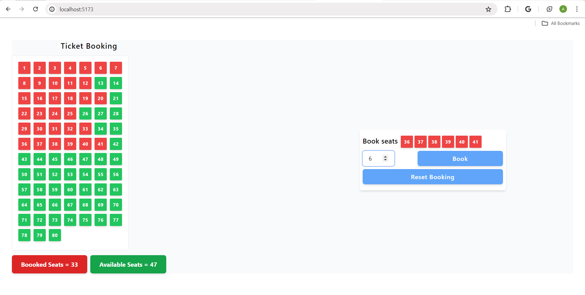

##  Train Seat Booking App (ZappHire) Problem

### 🔧 Tech Stack

- ⚛️ [React.js (Vite)](https://vitejs.dev/)
- 💨 [Tailwind CSS](https://tailwindcss.com/)

### 📦 Installation

1. **Clone the repository**
   ```bash
   git clone https://github.com/Aditya-Mishra799/Zapphire-Problem-Solution.git
   cd Zapphire-Problem-Solution
   ```

2. **Install dependencies**
   ```bash
   npm install
   ```

3. **Start the development server**
   ```bash
   npm run dev
   ```

4. **Open in browser**
   - Visit: `http://localhost:5173`

---

### 📸 Demo 

